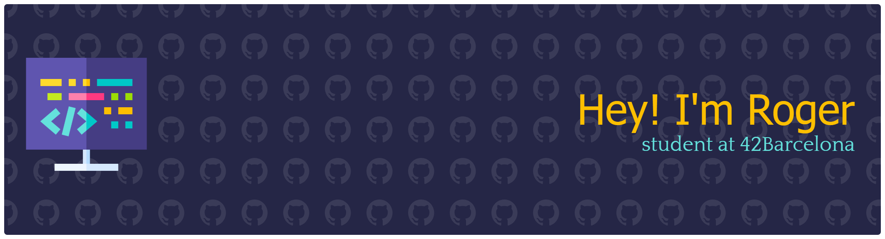

### ✨ Skills

| OS | Languages |
| :---: | :---: |
|   |   |

### 🐍 My Python Toolbox

| **Vector Graphics** | **Game Development** | **Web Development** | **Testing** |
| :---: | :---: | :---: | :---: |
|  |  |   |  |
###  Cursus Projects:
| Milestone | Project | Languages used | Score |
| :---: | :---: | :---: | :---: |
| M2 | [Python_piscine](https://github.com/IntRogerYT/Python-piscine) |  |  |
| M2 | [push_swap](https://github.com/IntRogerYT/push_swap) |     |   |
| M1 | [get_next_line](https://github.com/IntRogerYT/get_next_line) |   |  |
| M1 | [ft_printf](https://github.com/IntRogerYT/ft_printf) |     |  |
| M0 | [Libft](https://github.com/IntRogerYT/libft) |     |  |

### 🛠️ Other interesting projects
| Project | Languages used |
| :---: | :---: |
| [Pong_game](https://github.com/IntRogerYT/Pong-Game) |  |
| [Todo_app](https://github.com/IntRogerYT/todo_app) |   |
